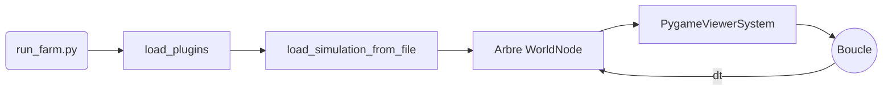
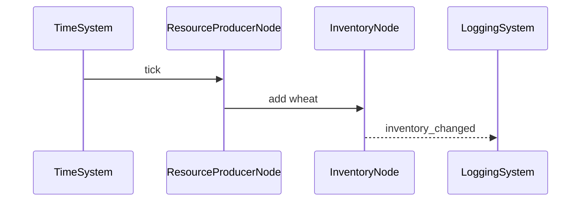
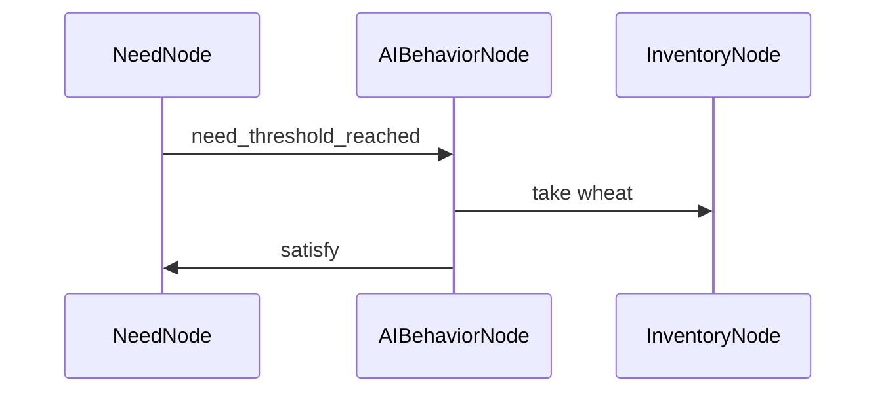

# Fonctionnement en mode `run`

Ce document décrit le déroulement de la simulation lorsque l'on exécute `run_farm.py`. Il met l'accent sur la structure des nœuds, les interactions et les flux de données qui permettent de faire évoluer le monde.

## 1. Déroulement général

1. **Chargement des plugins** : `run_farm.py` importe les modules nécessaires pour enregistrer toutes les classes de nœuds et de systèmes.
2. **Construction du monde** : `load_simulation_from_file("example_farm.json")` lit la configuration déclarative et instancie l'arbre de nœuds.
3. **Liaison des producteurs** : chaque `ResourceProducerNode` est relié à l'inventaire présent au même niveau hiérarchique.
4. **Boucle principale** : une boucle Pygame calcule `dt` et appelle `world.update(dt * TIME_SCALE)`.



## 2. Structure initiale du monde

L'exemple `example_farm.json` décrit un monde minimal. Le schéma suivant résume les principaux nœuds :

```
WorldNode
├─ HouseNode house1
│  ├─ TransformNode
│  └─ InventoryNode house1_inventory
├─ HouseNode house2
│  ├─ TransformNode
│  └─ InventoryNode house2_inventory
├─ HouseNode house3
│  ├─ TransformNode
│  └─ InventoryNode house3_inventory
├─ FarmNode farm1
│  ├─ TransformNode
│  ├─ InventoryNode farm1_inventory
│  └─ ResourceProducerNode producer1
├─ FarmNode farm2
│  ├─ TransformNode
│  ├─ InventoryNode farm2_inventory
│  └─ ResourceProducerNode producer2
├─ CharacterNode worker1/2/3
│  ├─ TransformNode
│  ├─ InventoryNode worker*_inventory
│  └─ AIBehaviorNode
├─ TimeSystem
├─ EconomySystem
├─ LoggingSystem
└─ PygameViewerSystem
```

## 3. Flux d'événements et de données

### 3.1 Temps et progression
`TimeSystem` émet un événement `tick` à intervalle régulier. Chaque nœud reçoit l'événement via la méthode `update` et peut modifier son état :



- `TimeSystem` maintient l'heure de la journée et émet aussi `phase_changed` quand un seuil est atteint.
- `ResourceProducerNode` ajoute la ressource produite dans son `InventoryNode` associé.
- `InventoryNode` diffuse `inventory_changed` aux observateurs (ex. `LoggingSystem`).

### 3.2 Besoins et comportement



- `NeedNode` augmente sa valeur et déclenche `need_threshold_reached` quand un seuil est atteint.
- `AIBehaviorNode` écoute cet événement pour transférer des ressources depuis un inventaire cible et appelle `satisfy` sur le besoin.

### 3.3 Échanges économiques

Lorsqu'un nœud veut acheter un objet, il émet `buy_request` vers `EconomySystem`, qui vérifie les inventaires et diffuse `buy_success` ou `buy_failed`.

## 4. Visualisation et observabilité

- `PygameViewerSystem` dessine chaque image en parcourant l'arbre de nœuds et en représentant les positions, inventaires et besoins.
- `LoggingSystem` écrit les événements clés (`tick`, `resource_produced`, `inventory_changed`, `need_threshold_reached`, ...).

## 5. Évolution du monde

À chaque itération de la boucle :

1. Calcul de `dt` réel et mise à l'échelle (`TIME_SCALE`) pour accélérer le temps simulé.
2. Appel à `world.update` qui propage l'`update` à tous les nœuds enfants.
3. Les systèmes et nœuds réagissent selon leurs règles (production de ressources, satisfaction des besoins, transactions économiques, etc.).
4. L'état est observé via la fenêtre Pygame et les logs.

Ce mécanisme itératif fait évoluer le monde au fil du temps de simulation.
